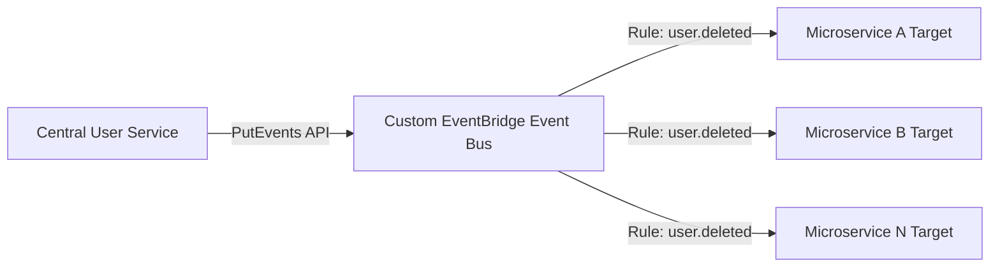

A delivery company is running a serverless solution in the AWS Cloud. The solution manages user data, delivery information, and past purchase details. The solution consists of several microservices. The central user service stores sensitive data in an Amazon DynamoDB table. Several of the other microservices store a copy of parts of the sensitive data in different storage services.

The company needs the ability to delete user information upon request. As soon as the central user service deletes a user, every other microservice must also delete its copy of the data immediately.

Which solution will meet these requirements?

A. Activate DynamoDB Streams on the DynamoDB table. Create an AWS Lambda trigger for the DynamoDB stream that will post events about user deletion in an Amazon Simple Queue Service (Amazon SQS) queue. Configure each microservice to poll the queue and delete the user from the DynamoDB table.
B. Set up DynamoDB event notifications on the DynamoDB table. Create an Amazon Simple Notification Service (Amazon SNS) topic as a target for the DynamoDB event notification. Configure each microservice to subscribe to the SNS topic and to delete the user from the DynamoDB table.
C. Configure the central user service to post an event on a custom Amazon EventBridge event bus when the company deletes a user. Create an EventBridge rule for each microservice to match the user deletion event pattern and invoke logic in the microservice to delete the user from the DynamoDB table.
D. Configure the central user service to post a message on an Amazon Simple Queue Service (Amazon SQS) queue when the company deletes a user. Configure each microservice to create an event filter on the SQS queue and to delete the user from the DynamoDB table.

Suggested Answer: C

# SAP-C02 Question Analysis — Serverless Event-Driven User Deletion Across Microservices

> **Exam Domain:** Design Solutions for Organizational Complexity  
> **Exam Sub-Domain:** Design event-driven architectures for microservices  
> **Tags:** #AWSSAPC02 #EventBridge #DynamoDB #Serverless #Microservices #EventDrivenArchitecture #SQS #SNS #Lambda #FanOut

---

## Understanding the Problem

The core challenge is implementing a **fan-out deletion pattern** in a serverless microservices architecture. When the central user service deletes a record from its DynamoDB table, every downstream microservice — each storing partial copies of that data in *different* storage services — must receive a notification and perform its own deletion. The key architectural requirements are:

1. **Immediate propagation** — deletion must happen as soon as the central service acts, not on a schedule.
2. **One-to-many notification** — a single deletion event must reach multiple independent consumers (fan-out).
3. **Serverless & decoupled** — the solution must align with the existing serverless posture and avoid tight coupling between the central service and each downstream microservice.
4. **Reliability** — every microservice must reliably receive the deletion event; no consumer should be silently skipped.

This is a classic **event-driven architecture** problem where the central service acts as an *event producer* and each microservice acts as an *event consumer*.

---

## AWS Services in Scope

### Amazon DynamoDB
- Fully managed NoSQL key-value/document database delivering single-digit millisecond performance.
- **DynamoDB Streams** captures a time-ordered sequence of item-level changes (INSERT, MODIFY, REMOVE) on a table. The stream retains data for 24 hours and can trigger AWS Lambda functions synchronously.
- **Important:** DynamoDB does **NOT** have a native "event notification" feature comparable to S3 Event Notifications. You cannot configure a DynamoDB table to directly publish to SNS or SQS without going through DynamoDB Streams + Lambda. This is a common exam trap.

### AWS Lambda
- Serverless compute service that runs code in response to triggers. DynamoDB Streams is a supported event source; Lambda polls the stream and invokes your function with batches of records.
- **Hands-on note:** Lambda with DynamoDB Streams uses an *event source mapping* — the Lambda service manages the poller internally. You control batch size, batch window, and retry behavior through the event source mapping configuration.

### Amazon SQS (Simple Queue Service)
- Fully managed message queuing service. **SQS follows a point-to-point (queue) model:** a message is consumed by exactly one consumer. Once a consumer successfully processes and deletes the message, it is removed from the queue.
- **Critical limitation for this scenario:** A single SQS queue cannot fan out the same message to multiple independent consumers. If microservice A polls and deletes the message, microservice B will never see it.
- To achieve fan-out with SQS, you must pair it with SNS (SNS topic → multiple SQS queues, one per consumer). This is the **SNS-SQS fan-out pattern**.

### Amazon SNS (Simple Notification Service)
- Fully managed pub/sub messaging service. A single message published to an SNS topic is delivered to **all** subscribers (fan-out). Subscribers can be SQS queues, Lambda functions, HTTP/S endpoints, email, SMS, etc.
- **Key constraint in this scenario:** DynamoDB cannot publish directly to SNS. There is no native DynamoDB → SNS integration — another exam trap.

### Amazon EventBridge
- **Serverless event bus** purpose-built for event-driven architectures. It ingests events from producers (AWS services, custom applications, SaaS partners) and routes them to consumers based on **event patterns** defined in rules.
- **Key capabilities:**
  - **Custom event buses** — you can create your own event bus to isolate application events from the default AWS service event bus.
  - **Event pattern matching** — rules can match on any field in the event JSON (e.g., `{ "detail-type": ["User Deleted"] }`), enabling precise routing.
  - **Multiple targets per rule** — a single rule can fan out to up to 5 targets; you can also create multiple rules for the same event pattern, each targeting different microservices.
  - **Schema Registry** — helps you discover and version event schemas across your organization.
- **Why EventBridge shines here:** It is designed for exactly this use case — an application emitting custom events that must be routed to multiple downstream consumers with flexible filtering.

---

## Correct Option: C — Amazon EventBridge with Custom Event Bus

### How It Works

1. The central user service calls the EventBridge `PutEvents` API to publish a custom event (e.g., `detail-type: "User Deleted"`, with `userId` in the `detail` field) to a **custom event bus**.
2. You create an **EventBridge rule** for each microservice that matches the event pattern `{ "detail-type": ["User Deleted"] }`.
3. Each rule targets the corresponding microservice — which could be a Lambda function, an ECS task, an API Gateway endpoint, a Step Functions state machine, or even an SQS queue if the microservice prefers pull-based processing.
4. Each microservice receives the event and deletes its copy of the user data from its own storage service (DynamoDB, RDS, S3, ElastiCache, etc.).

### Why This Is the Best Answer

- **True fan-out:** EventBridge delivers the same event to every matching rule, ensuring no microservice is missed.
- **Loose coupling:** The central service knows nothing about the consumers — it just publishes events. Adding a new microservice only requires creating a new rule; no changes to the producer.
- **Immediate:** Events are delivered in near-real-time (typically sub-second).
- **Serverless-native:** EventBridge is fully managed, scales automatically, and integrates seamlessly with the existing serverless stack.
- **Event filtering at the bus level:** Rules can include complex content-based filters, so microservices only receive events relevant to them — reducing unnecessary invocations.

> **📚 Official Reference:** [Amazon EventBridge User Guide – What Is Amazon EventBridge?](https://docs.aws.amazon.com/eventbridge/latest/userguide/eb-what-is.html)

---

## Incorrect Options Explained

### Option A — DynamoDB Streams → Lambda → SQS

| Step | Issue |
|------|-------|
| DynamoDB Streams captures deletion | ✅ Works — Streams records contain `REMOVE` events with the old item image |
| Lambda reads stream & publishes to SQS | ✅ Works — Lambda can transform and forward the event |
| **Multiple microservices poll the SAME SQS queue** | ❌ **Fatal flaw** — SQS is point-to-point. The first microservice to receive and delete the message removes it from the queue. Other microservices never see it. |

**How to fix it:** Replace the single SQS queue with SNS → multiple SQS queues (one per microservice). But the option as written is incorrect because it uses a single SQS queue for fan-out.

> **📚 Official Reference:** [Amazon SQS Developer Guide – Basic Architecture](https://docs.aws.amazon.com/AWSSimpleQueueService/latest/SQSDeveloperGuide/sqs-basic-architecture.html) — "A single queue can be used simultaneously by many distributed application components, with no need for those components to coordinate with each other to share the queue." However, each message is processed by only one component.

### Option B — DynamoDB "Event Notifications" → SNS

| Step | Issue |
|------|-------|
| Set up DynamoDB event notifications | ❌ **Feature does not exist.** DynamoDB does NOT have an "event notification" feature. This is a distractor that confuses DynamoDB with S3, which does have native event notifications to SNS/SQS/Lambda. |
| SNS topic as target for DynamoDB event notification | ❌ Since DynamoDB event notifications don't exist, this target configuration is impossible. |

**Key takeaway:** DynamoDB's only built-in change-data-capture mechanism is **DynamoDB Streams** (and Kinesis Data Streams for DynamoDB). There is no direct DynamoDB → SNS integration. If the exam mentions "DynamoDB event notifications," treat it as a red flag.

> **📚 Official Reference:** [Amazon DynamoDB Developer Guide – Capturing Table Activity with DynamoDB Streams](https://docs.aws.amazon.com/amazondynamodb/latest/developerguide/Streams.html)

### Option D — Central User Service → SQS with "Event Filters"

| Step | Issue |
|------|-------|
| Central service posts to SQS | ✅ Simple enough — `SendMessage` API call |
| Microservices create "event filters" on the SQS queue | ❌ **SQS does not have an "event filter" concept.** Event filtering (content-based routing) is an EventBridge and SNS feature (subscription filter policies), not an SQS feature. SQS delivers raw messages — there is no server-side filtering. |
| Multiple consumers on one queue | ❌ Same point-to-point limitation as Option A — fan-out fails. |

**This is a classic distractor** that mixes SQS with EventBridge/SNS terminology ("event filter") to test whether you understand the distinct capabilities of each messaging service.

---

## Hands-On Comparison: When to Use Each Service

| Pattern | Service | Use Case |
|---------|---------|----------|
| **Point-to-point / Work queue** | SQS | Decouple a producer from a single consumer; buffer requests; smooth traffic spikes |
| **Fan-out (same message → many)** | SNS | Push a notification to many subscribers (SQS queues, Lambda, HTTP, email, SMS) |
| **Event routing & filtering** | EventBridge | Route events based on content patterns to multiple targets; build event-driven microservices; integrate with SaaS providers |
| **Change data capture** | DynamoDB Streams | React to item-level changes in a DynamoDB table; maintain materialized views; trigger downstream processing |
| **Fan-out from DynamoDB** | DynamoDB Streams → Lambda → EventBridge | Combine Streams for CDC with EventBridge for fan-out routing |

---

## SAP-C02 Exam Tips

1. **DynamoDB has NO native event notifications to SNS/SQS** — only DynamoDB Streams (and Kinesis Data Streams). This is tested repeatedly.
2. **SQS = point-to-point (one consumer per message).** For fan-out, you need SNS or EventBridge.
3. **EventBridge is the go-to service for custom event-driven architectures** on AWS — especially when you need content-based routing, multiple consumers, and schema management.
4. **SNS subscription filter policies** can achieve fan-out with filtering too, but EventBridge offers richer pattern matching and a broader range of targets.
5. When the question talks about "microservices" and "each microservice must do X," think **fan-out** — and then immediately eliminate SQS-only solutions.

