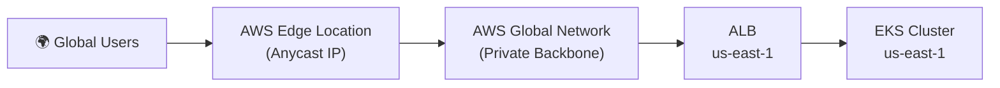

A software-as-a-service (SaaS) provider exposes APIs through an Application Load Balancer (ALB). The ALB connects to an Amazon Elastic Kubernetes Service (Amazon EKS) cluster that is deployed in the us-east-1 Region. The exposed APIs contain usage of a few non-standard REST methods: LINK, UNLINK, LOCK, and UNLOCK.

Users outside the United States are reporting long and inconsistent response times for these APIs. A solutions architect needs to resolve this problem with a solution that minimizes operational overhead.

Which solution meets these requirements?

A. Add an Amazon CloudFront distribution. Configure the ALB as the origin.
B. Add an Amazon API Gateway edge-optimized API endpoint to expose the APIs. Configure the ALB as the target.
C. Add an accelerator in AWS Global Accelerator. Configure the ALB as the origin.
D. Deploy the APIs to two additional AWS Regions: eu-west-1 and ap-southeast-2. Add latency-based routing records in Amazon Route 53.

Suggest Answer: C

---

## 📋 Analysis

### Understanding the Problem

A **SaaS provider** hosts APIs behind an **Application Load Balancer (ALB)** that connects to an **Amazon EKS cluster** in the **us-east-1** (North Virginia) Region. The APIs expose several **non-standard HTTP methods** — specifically `LINK`, `UNLINK`, `LOCK`, and `UNLOCK` — which are WebDAV/extension methods not part of the standard HTTP/1.1 specification (RFC 7231).

Users **outside the United States** are experiencing **long and inconsistent response times**. The solutions architect must:

1. **Reduce latency for global users** accessing these APIs.
2. **Support non-standard HTTP methods** (LINK, UNLINK, LOCK, UNLOCK).
3. **Minimize operational overhead** — avoid managing multi-region infrastructure if possible.

---

### ✅ Correct Option: C

**Add an accelerator in AWS Global Accelerator. Configure the ALB as the origin.**

**Why this is correct:**

| Requirement | How Option C Fulfills It |
|---|---|
| **Global latency reduction** | Global Accelerator routes user traffic through the **AWS global network backbone** (not the public internet). It provides two static Anycast IP addresses that serve as a fixed entry point, directing traffic to the nearest AWS edge location, which then traverses AWS's private, redundant, low-latency network to reach the ALB in us-east-1. |
| **Non-standard HTTP methods** | Global Accelerator operates at **Layer 4 (TCP/UDP)** and **does not inspect or validate HTTP methods**. It transparently forwards all TCP packets — regardless of HTTP method — from the edge location to the origin ALB. HTTP methods like `LINK`, `UNLINK`, `LOCK`, and `UNLOCK` pass through unchanged. |
| **Minimal operational overhead** | Global Accelerator is a **fully managed service** — no infrastructure to deploy in additional regions, no DNS routing policies to maintain, no application changes required. You simply create an accelerator and register the ALB as an endpoint. |

**How Global Accelerator Works:**

---

### ❌ Incorrect Options

| Option | Why It Fails |
|---|---|
| **A (CloudFront + ALB origin)** | Amazon CloudFront is a **Layer 7 (HTTP/HTTPS)** CDN that only supports standard HTTP methods: `GET`, `POST`, `PUT`, `PATCH`, `DELETE`, `HEAD`, and `OPTIONS`. The non-standard methods — **LINK, UNLINK, LOCK, UNLOCK** — are **not supported** by CloudFront and would be rejected at the edge. Reference: [CloudFront — Supported HTTP Methods](https://docs.aws.amazon.com/AmazonCloudFront/latest/DeveloperGuide/RequestAndResponseBehaviorCustomOrigin.html#request-custom-http-methods) |
| **B (API Gateway edge-optimized endpoint)** | Amazon API Gateway (REST API) only supports standard HTTP methods: `GET`, `POST`, `PUT`, `PATCH`, `DELETE`, `HEAD`, `OPTIONS`, and `ANY` (as a catch-all for supported methods only). The non-standard methods **LINK, UNLINK, LOCK, UNLOCK** are **not recognized** by API Gateway and would return `405 Method Not Allowed`. While HTTP APIs support a broader set, API Gateway is fundamentally an HTTP-layer service that validates methods. |
| **D (Multi-region deployment + Route 53 latency routing)** | Deploying EKS clusters and ALBs to **eu-west-1** (Ireland) and **ap-southeast-2** (Sydney) requires managing infrastructure across three Regions — provisioning clusters, synchronizing application deployments, managing data replication (if stateful), and monitoring each Region independently. This **significantly increases operational overhead**, contradicting the "minimize operational overhead" requirement. Latency routing also relies on public DNS resolution, which may not be as fast as Global Accelerator's Anycast + backbone routing. |

---

### 🏭 Hands-on Enterprise Knowledge

1. **Global Accelerator vs. CloudFront — Key Decision Factors:**

   | Factor | Global Accelerator | CloudFront |
   |---|---|---|
   | **OSI Layer** | Layer 4 (TCP/UDP) | Layer 7 (HTTP/HTTPS) |
   | **Protocol Support** | TCP, UDP, HTTP, HTTPS, WebSocket, gRPC, VoIP, gaming | HTTP/HTTPS only |
   | **HTTP Method Filtering** | None — all methods pass through | Only standard methods (GET, POST, PUT, PATCH, DELETE, HEAD, OPTIONS) |
   | **Caching** | No | Yes (edge caching) |
   | **Static IP** | Yes (2 Anycast IPs) | No (uses CloudFront domain; can add custom SSL) |
   | **Failover Speed** | < 30 seconds | 30+ seconds (DNS propagation) |
   | **Use Case** | Low-latency TCP/UDP, non-HTTP workloads, static IP requirement, fast failover | HTTP content delivery, caching, DDoS protection at edge |

2. **WebDAV Methods in Real-World SaaS:**
   - `LOCK`/`UNLOCK` are WebDAV (RFC 4918) methods used by collaborative editing tools, document management systems, and calendar applications.
   - `LINK`/`UNLINK` are defined in RFC 2068 (HTTP/1.1 extension) and are sometimes used in RESTful resource relationship management.
   - If your SaaS exposes these methods, you **cannot** place CloudFront or API Gateway in front of the ALB — Global Accelerator is the only AWS global-traffic service that transparently proxies them.

3. **Global Accelerator Performance:**
   - Traffic ingress: Users enter via the nearest AWS edge location (200+ PoPs globally).
   - Backbone routing: From the edge, traffic travels over the **AWS global network** (not the public internet), avoiding congestion, packet loss, and BGP routing inefficiencies.
   - Expected improvement: **30–60% latency reduction** for intercontinental traffic compared to public internet routing.
   - TCP termination at the edge location and re-origination over optimized AWS backbone TCP connections (TCP proxy mode) further improves throughput.

4. **EKS Multi-Region Complexity (Why D Fails):**
   - Requires **container image replication** to ECR repositories in each Region.
   - Requires **GitOps/CD pipeline** to deploy consistently across clusters (e.g., Argo CD or Flux).
   - If the application is stateful, you need **cross-region data replication** (e.g., DynamoDB Global Tables, Aurora Global Database, or S3 Cross-Region Replication).
   - **Route 53 latency records** rely on end-user DNS resolvers, which may not always route to the optimal endpoint (DNS-based routing is inherently less precise than Anycast-based routing).

5. **Non-Standard Methods and ALB:**
   - The ALB itself does support non-standard HTTP methods because it proxies at Layer 7 but does **not** restrict methods — it forwards all valid HTTP requests regardless of method. The constraint is on CDN/gateway services placed in front.

---

**Tags:** #AWSGlobalAccelerator #AmazonEKS #ApplicationLoadBalancer #CloudFront #APIGateway #Latency #NonStandardHTTP #WebDAV #GlobalInfrastructure #Networking #SAP-C02

---

## Related Files
- 馃摉 [[AWS-SAP-C02-Learning-Material#networking|Textbook: Ch 05]]
- 馃搵 [[Practice-Ch-05-Networking|Practice Questions: Ch 05]]
- 馃攢 [[Architecture-Decision-Trees|Architecture Decision Trees]]
- 馃椇锔?[[Task-Statement-Mapping|Exam Task Statement Map]]
