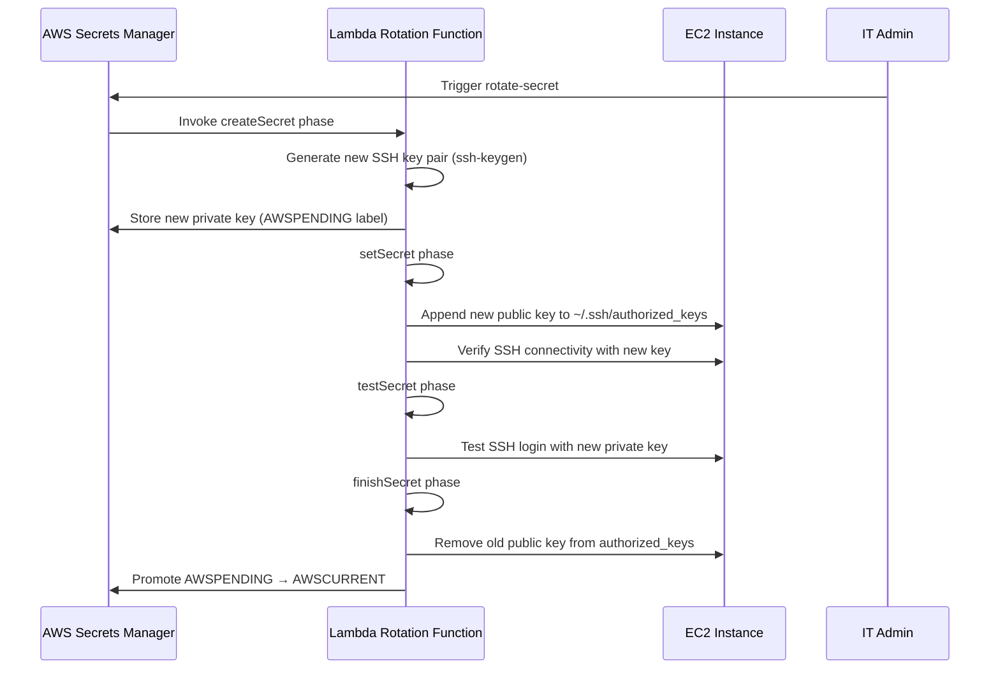

A company has Linux-based Amazon EC2 instances. Users must access the instances by using SSH with EC2 SSH key pairs. Each machine requires a unique EC2 key pair.

The company wants to implement a key rotation policy that will, upon request, automatically rotate all the EC2 key pairs and keep the keys in a securely encrypted place. The company will accept less than 1 minute of downtime during key rotation.

Which solution will meet these requirements?

A. Store all the keys in AWS Secrets Manager. Define a Secrets Manager rotation schedule to invoke an AWS Lambda function to generate new key pairs. Replace public keys on EC2 instances. Update the private keys in Secrets Manager.
B. Store all the keys in Parameter Store, a capability of AWS Systems Manager, as a string. Define a Systems Manager maintenance window to invoke an AWS Lambda function to generate new key pairs. Replace public keys on EC2 instances. Update the private keys in Parameter Store.
C. Import the EC2 key pairs into AWS Key Management Service (AWS KMS). Configure automatic key rotation for these key pairs. Create an Amazon EventBridge scheduled rule to invoke an AWS Lambda function to initiate the key rotation in AWS KMS.
D. Add all the EC2 instances to Fleet Manager, a capability of AWS Systems Manager. Define a Systems Manager maintenance window to issue a Systems Manager Run Command document to generate new key pairs and to rotate public keys to all the instances in Fleet Manager.

Suggest Answer: A

---

## 📋 Analysis

### Understanding the Problem

A company manages **Linux-based Amazon EC2 instances** accessed via **SSH with EC2 key pairs**. The requirements are:

1. **Each machine requires a unique EC2 key pair** — no shared keys across instances.
2. **On-demand automatic key rotation** — the rotation must be triggerable upon request.
3. **Secure, encrypted storage** for all private keys.
4. **Less than 1 minute of downtime** during rotation — the SSH service must remain available with minimal interruption.

The core challenge is designing a system that can generate new SSH key pairs, distribute public keys to EC2 instances, securely store private keys in an encrypted vault, and complete the rotation within the tight downtime window — all without manual intervention.

---

### ✅ Correct Option: A

**Store all keys in AWS Secrets Manager. Define a Secrets Manager rotation schedule to invoke an AWS Lambda function that generates new key pairs, replaces public keys on EC2 instances, and updates private keys in Secrets Manager.**

**Why this is correct:**

| Requirement | How Option A Fulfills It |
|---|---|
| **Secure encrypted storage** | AWS Secrets Manager encrypts secrets at rest using AWS KMS. Each secret (private key) is individually encrypted with a KMS CMK, meeting the "securely encrypted place" requirement. |
| **Automatic rotation upon request** | Secrets Manager rotation can be **triggered immediately on demand** (via `rotate-secret` CLI/API) or scheduled. The rotation invokes a custom **Lambda rotation function** that orchestrates the full lifecycle: generate new key pair → replace public key on EC2 → update private key in Secrets Manager. |
| **Unique keys per machine** | Each EC2 instance's key pair is stored as a **separate secret** in Secrets Manager, with its own rotation configuration, ensuring one-to-one mapping of keys to instances. |
| **Minimal downtime** | SSH supports **multiple authorized keys**. The Lambda rotation function can append the new public key to `~/.ssh/authorized_keys` on the instance, verify the new key works, then remove the old key — all within seconds. This ensures < 1 minute of transition time. |

**Rotation Workflow Diagram:**

---

### ❌ Incorrect Options

| Option | Why It Fails |
|---|---|
| **B (Parameter Store as plain string)** | Storing private keys in **Systems Manager Parameter Store as a plain String** (not SecureString) means the keys are **not encrypted at rest**. The requirement explicitly states keys must be kept in a "securely encrypted place." Parameter Store String parameters are stored in plaintext and visible in the console. While Parameter Store SecureString exists, the option specifies "string" type, which is unencrypted. Additionally, Parameter Store does not have **native rotation functionality** — you would need to build the entire rotation orchestration yourself. |
| **C (Import SSH keys into AWS KMS)** | AWS KMS is designed for managing **cryptographic keys** (symmetric/asymmetric encryption keys, signing keys, HMAC keys) — it is **not a storage service for arbitrary key material like SSH private keys**. You cannot "import an EC2 key pair into KMS." KMS automatic key rotation rotates the **KMS backing key material**, not the SSH key pair itself. This option fundamentally misunderstands the purpose and capabilities of AWS KMS. KMS generates and manages encryption keys; SSH key pairs are a different type of cryptographic artifact. |
| **D (Fleet Manager + Run Command without secure storage)** | Fleet Manager (part of AWS Systems Manager) enables remote management of EC2 instances and Run Command can execute scripts to generate and deploy SSH keys. However, this option does **not specify where private keys are securely stored after rotation**. Without a vaulting mechanism (like Secrets Manager or Parameter Store SecureString), the keys remain unprotected. Fleet Manager + Run Command handles the *distribution* aspect but fails the *secure encrypted storage* requirement entirely. |

---

### 🏭 Hands-on Enterprise Knowledge

1. **Secrets Manager Rotation Strategy — Custom Lambda for SSH Keys:**
   - Unlike RDS which has built-in rotation support, SSH key rotation requires a **custom Lambda rotation function** following the four-phase rotation model (`createSecret`, `setSecret`, `testSecret`, `finishSecret`).
   - The Lambda function needs:
     - **IAM permissions**: `secretsmanager:GetSecretValue`, `secretsmanager:PutSecretValue`, `ec2:DescribeInstances`, `ssm:SendCommand` (to execute commands on EC2 instances).
     - **Network access**: Either VPC-attached Lambda or internet access via NAT Gateway to reach EC2 instances (if using SSH directly).
     - **SSM Agent**: Installed on EC2 instances to receive Run Command documents for key deployment.

2. **Why Less Than 1 Minute is Achievable:**
   - SSH `authorized_keys` supports **multiple keys simultaneously**. The rotation process:
     1. Append new public key → instant (milliseconds).
     2. Test SSH connection with new key → 2–5 seconds.
     3. Remove old public key → instant.
   - Total downtime window: effectively **zero** — there is no interruption to existing sessions. Only new connections must use the new key.

3. **Systems Manager Run Command vs. Direct SSH — Key Deployment Methods:**

   | Method | Pros | Cons |
   |---|---|---|
   | **SSM Run Command** | No need for open SSH port (port 22); works with private subnets; IAM-audited; agent-based | Requires SSM Agent + instance profile with SSM permissions |
   | **Direct SSH** | No SSM Agent dependency; simpler for non-AWS AMIs | Requires network path to port 22; needs existing valid key to connect |

   For enterprise environments, **SSM Run Command** is preferred because it eliminates the chicken-and-egg problem of needing a valid SSH key to deploy a new SSH key.

4. **Secrets Manager Quotas to Consider:**
   - **Maximum 500,000 secrets per account per Region** — sufficient for most enterprise fleets.
   - **API rate limits**: `GetSecretValue` — 10,000 TPS per Region; `PutSecretValue` — 1,200 TPS per Region.
   - For large-scale rotation (>1000 instances), stagger rotation schedules to avoid throttling.

5. **KMS Key for Secrets Manager:**
   - Secrets Manager uses a KMS CMK to encrypt each secret. You can use the **default Secrets Manager key** (`aws/secretsmanager`) or a **customer managed key (CMK)** for finer control.
   - Using a CMK allows you to enforce **key rotation policies**, audit access via CloudTrail, and restrict usage to specific IAM principals via key policy.
   - Reference: [AWS Secrets Manager — Secret Encryption and Decryption](https://docs.aws.amazon.com/secretsmanager/latest/userguide/security-encryption.html)

6. **Alternative Enterprise Pattern — EC2 Instance Connect:**
   - AWS offers **EC2 Instance Connect** which uses short-lived SSH keys pushed to instances via the EC2 Instance Connect API — no long-lived key pairs to rotate.
   - However, EC2 Instance Connect does not support per-instance unique *persistent* keys; it's designed for interactive, temporary access. For automated processes requiring stored keys, Secrets Manager + rotation Lambda is the appropriate pattern.

7. **Operational Readiness Checklist for SSH Key Rotation:**
   - ☐ Lambda rotation function tested with all AMI variants in the fleet
   - ☐ CloudWatch Alarms configured for rotation failures
   - ☐ Secrets Manager rotation logs sent to CloudWatch Logs
   - ☐ Rotation failure rollback procedure documented (retain old key in AWSPREVIOUS label for one rotation cycle)
   - ☐ SSM Agent version ≥ 3.1 on all instances (for Run Command integration)

---

**Tags:** #AWSSecretsManager #AWSLambda #EC2 #SSH #KeyRotation #Security #SystemsManager #Encryption #Automation #SAP-C02 #KeyManagement
