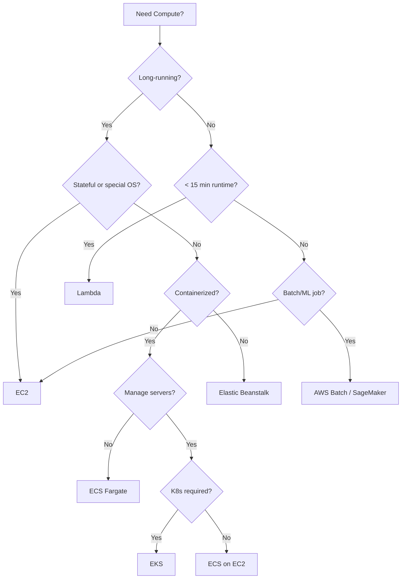
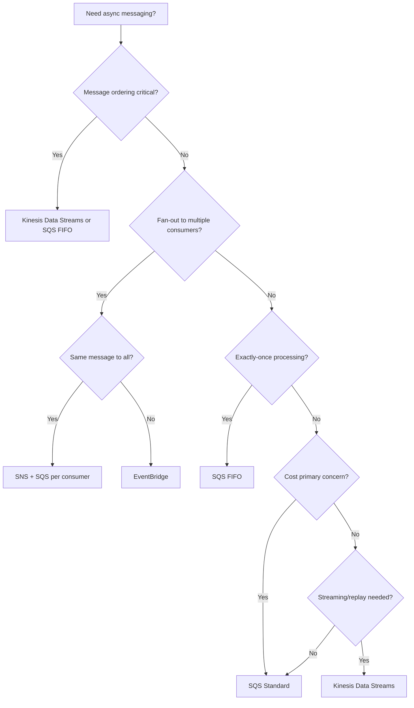
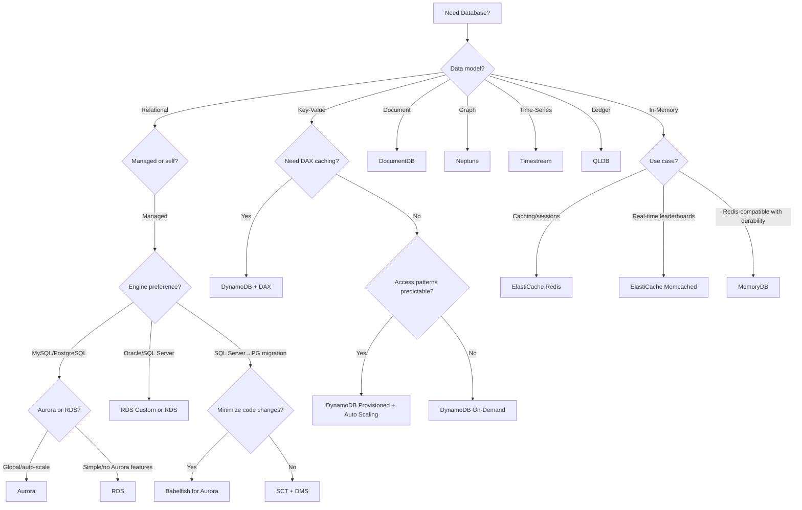
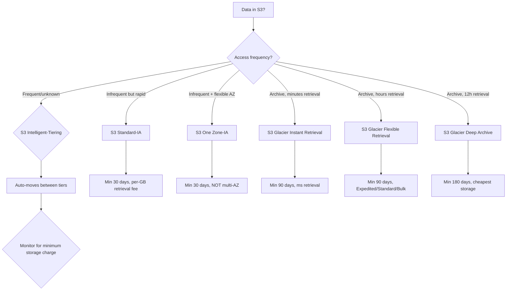
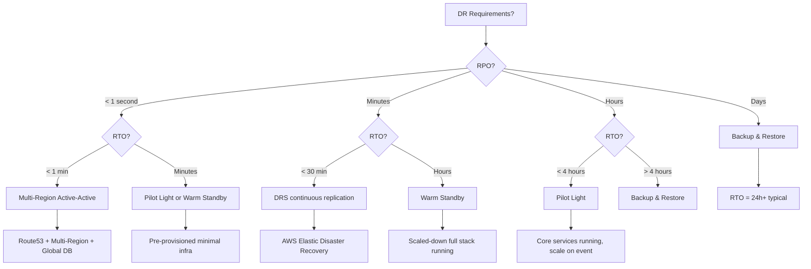
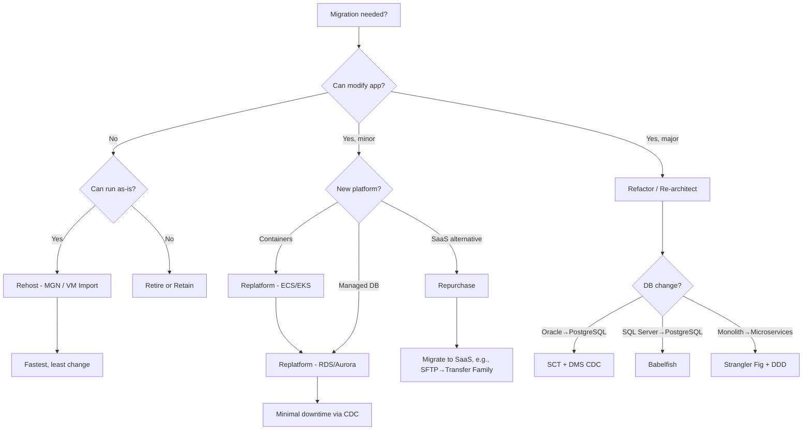

# AWS SAP-C02 Architecture Decision Trees

> Use these flowcharts when faced with "which service to use" questions on the exam.
> Each tree covers the most commonly tested service selection scenarios.

---

## 1. Compute Choice



**Key Exam Traps:**
- Lambda max 15 min → Step Functions for longer orchestrations
- Fargate = no host access → daemon agents need EC2 launch type
- EKS for K8s ecosystem, ECS for simpler AWS-native orchestration

---

## 2. Messaging & Decoupling



**Key Exam Traps:**
- SNS = push to many, SQS = pull by one, EventBridge = pattern-based routing
- Kinesis = ordered + replayable + multi-consumer (enhanced fan-out)
- SQS FIFO = 300 msg/s (batch), 3000 msg/s (high throughput mode)

---

## 3. Database Selection



**Key Exam Traps:**
- Aurora Global Database = RPO < 1s, RTO < 1min (cross-Region)
- DynamoDB hot partition → redesign partition key, NOT increase capacity
- DAX = microsecond reads for DynamoDB only (not RDS)
- ElastiCache vs MemoryDB: MemoryDB is durable (multi-AZ transaction log)

---

## 4. Storage Class Selection



**Key Exam Traps:**
- Intelligent-Tiering has monitoring charge per object → not for trillions of tiny objects
- Lifecycle 30→90→180 day minimums → early delete fees
- S3 RTC = 15 min SLA for replication (compliance use case)
- S3 Object Lock = WORM (compliance/legal hold)

---

## 5. Networking: Connectivity Patterns

```mermaid
flowchart TD
    A[Need network connectivity?] --> B{Between what?}
    B -->|VPC to VPC (same Region)| C{How many VPCs?}
    B -->|VPC to on-prem| D{Bandwidth + SLA?}
    B -->|Cross-Region VPCs| E[TGW peering or Cloud WAN]
    B -->|Service to VPC (private)| F[AWS PrivateLink]
    
    C -->|< 10| G[VPC Peering]
    C -->|> 10| H{AWS Cloud WAN or TGW?}
    H -->|Global segmentation| I[Cloud WAN]
    H -->|Single Region| J[Transit Gateway]
    
    D -->|< 1 Gbps + best effort| K[Site-to-Site VPN]
    D -->|> 1 Gbps + SLA| L[AWS Direct Connect]
    D -->|DC backup| M[VPN as backup to DC]
    
    F --> N{Consumer in another account?}
    N -->|Yes| O[Endpoint service + RAM]
    N -->|No| P[Interface Endpoint]
```

**Key Exam Traps:**
- VPC Peering = no transitive routing, 1:1 relationship
- TGW = transitive, route tables for segmentation
- PrivateLink = unidirectional, consumer→provider, no overlapping CIDR issue
- Cloud WAN = global SD-WAN for multi-Region VPC networks
- NAT Gateway is per-AZ; for HA deploy one per AZ

---

## 6. Disaster Recovery Strategy



**Key Exam Traps:**
- DRS = continuous block-level replication, RPO ~seconds, RTO ~minutes
- AWS Backup = snapshot-based, RPO measured in hours
- Aurora Global Database = RPO < 1s, RTO < 1min for DB only
- Multi-AZ ≠ DR (same Region); Cross-Region Read Replica ≠ automatic failover
- Pilot Light = data replicated + minimal compute; Warm Standby = scaled-down full stack

---

## 7. Authorization & Access Control

```mermaid
flowchart TD
    A[Need access control?] --> B{Scope?}
    B -->|Single account| C{IAM Policy type?}
    B -->|Multi-account (Org)| D{Central governance?}
    B -->|External (cross-account)| E[IAM Role + Trust Policy]
    B -->|Public/external users| F[Cognito / Identity Pools]
    
    C -->|User/group/role| G[Identity-based policy]
    C -->|S3/SQS/KMS etc| H[Resource-based policy]
    C -->|VPC-level| I[NACL + Security Groups]
    
    D -->|Preventative guardrails| J[SCP]
    D -->|Tag enforcement| K[Tag Policies]
    D -->|Service restrictions| L[SCP with condition keys]
    D -->|Detective| M[Config + Audit Manager]
    
    E --> N{External ID needed?}
    N -->|Yes (3rd party)| O[sts:ExternalId condition]
    N -->|No (same org)| P[Trust principal: account ARN]
```

**Key Exam Traps:**
- SCPs don't grant permissions — they only restrict maximum permissions
- Resource-based policies can grant cross-account access without role assumption
- IAM policy evaluation: explicit DENY > SCP DENY > resource DENY > ALLOW
- Permission boundaries = limit what IAM entity can do (not cross-account)

---

## 8. Migration Strategy Selection (7 Rs)



**Key Exam Traps:**
- MGN = continuous block replication (rehost), agent-based
- DMS = database only; SCT = schema conversion
- DataSync = file-level; Snow Family = physical transfer for large datasets
- Replatform ≠ Refactor: replatform = minor changes (OS→containers), refactor = major (monolith→microservices)

---

## Quick Reference: Service → Answer Mapping

| If you see... | Think... |
|---|---|
| "preventive, centrally managed" | SCP |
| "detect public S3 bucket" | IAM Access Analyzer |
| "auto-remediate unencrypted EBS" | Config + SSM Automation |
| "serverless, no idle cost, real-time" | Lambda + AppSync/DynamoDB |
| "sub-second failover, static IP" | Global Accelerator |
| "slow DNS failover (TTL issue)" | Global Accelerator or CloudFront Origin Group |
| "RPO < 1s, RTO < 1min for DB" | Aurora Global Database |
| "RPO seconds, RTO minutes for EC2" | DRS (Elastic Disaster Recovery) |
| "block public S3 at org level" | SCP + S3 Block Public Access |
| "temporary credentials, no IAM users" | IAM Role + sts:AssumeRole |
| "overlapping CIDRs, private sharing" | PrivateLink |
| "1000 VPCs, global, segmented" | Cloud WAN |
| "thundering herd on Redis" | Probabilistic early expiration |
| "DynamoDB hot partition" | Redesign partition key |
| "cost allocation, tag inconsistency" | Tag Policies + Cost Explorer |
| "find optimal EC2 type from metrics" | Compute Optimizer |
