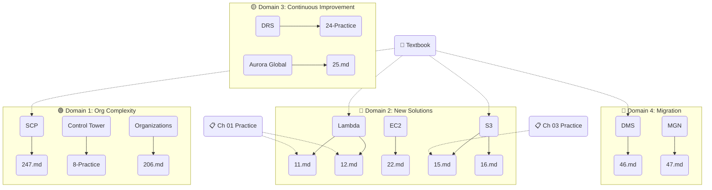

# Obsidian 适配计划

> 将 243 个 .md 文件从「孤立节点集合」升级为「可交互的知识图谱」。

---

## 1. 现状诊断

```
━━━━━━━━━━━━━━━━━━━━━━━━━━━━━━━━━
  指标                    当前值       目标值
━━━━━━━━━━━━━━━━━━━━━━━━━━━━━━━━━
  .md 文件总数             243         243
  有 YAML frontmatter       24 (10%)   243 (100%)
  有 Obsidian tags          24         243
  有 [[wikilink]]            0 (0%)    ~500+
  Graph 节点数             243         243
  Graph 连线数               0        ~400+
  Graph 颜色分组             0 (全灰)    6+ 颜色
  Tag Pane 可用性          近乎空      完整层级
  Backlinks 可用性           无         全文件
━━━━━━━━━━━━━━━━━━━━━━━━━━━━━━━━━
```

### 当前 Obsidian 效果

打开 Graph View → 243 个灰色孤立节点漂浮，零连线，零分组。Backlinks 面板始终为空。Tag Pane 只有 24 个文件的少量标签。

### 已启用插件（.obsidian/core-plugins.json）

| 插件 | 状态 | 适配后效果 |
|------|:--:|------|
| Graph | ON | 节点分组着色 → 服务/章节/域层级可见 |
| Backlinks | ON | 单击任意文件 → 显示所有引用它的文件 |
| Outgoing Links | ON | 单击任意文件 → 显示它引用的文件 |
| Tag Pane | ON | 层级标签树 → 快速导航 |
| Canvas | ON | 手动创建白板 → 可用已链接节点 |
| Outline | ON | 每个文件的结构化标题 |
| Bookmarks | ON | 快速跳转高频文件 |
| Search | ON | 全文搜索 + 标签过滤 |

---

## 2. 目标架构

### 2.1 知识图谱结构（Graph View 理想效果）



### 2.2 Backlinks 面板效果

打开 `Lambda` 相关文件时，Backlinks 自动显示：
```
Backlinks for Lambda
├── 📖 AWS-SAP-C02-Learning-Material.md  (Ch 01 Compute > Lambda)
├── 📝 11.md  ("Global serverless web app")
├── 📝 12.md  ("IoT messages -> Lambda")
├── 📋 Practice-Ch-01-Compute.md  (Q1.11, Q1.12)
└── 🔀 Architecture-Decision-Trees.md  (Decision Tree #1)
```

---

## 3. YAML Frontmatter 设计

### 3.1 统一模板

所有 243 个文件使用一致的 YAML frontmatter：

```yaml
---
qid: 247                           # 错题编号（错题文件专用）
chapter: "Ch 00"                   # 所属章节
services:                          # 涉及的 AWS 服务
  - Organizations
  - SCP
  - Cost_and_Usage_Report
exam_domains:                      # SAP-C02 考试域
  - Domain1_OrganizationalComplexity
tags:                              # Obsidian 兼容标签（层级）
  - aws
  - resource/reference
  - domain/org-complexity
  - service/organizations
  - service/scp
  - service/cur
  - topic/cost-allocation
  - topic/multi-account
difficulty: 🟡                     # 🟢 L1 / 🟡 L2 / 🔴 L3
interview_relevance: 🎤🎤          # 🎤 低 / 🎤🎤 中 / 🎤🎤🎤 高
links:                             # [[wikilink]] 目标
  - "[[AWS-SAP-C02-Learning-Material#Organizations]]"
  - "[[Practice-Ch-00-CrossCutting]]"
---
```

### 3.2 字段说明

| 字段 | 类型 | 用途 | Obsidian 图形效果 |
|------|------|------|------|
| `qid` | number | 错题编号 | 节点 label 显示 |
| `chapter` | string | 章节归属 | 按章节筛选 |
| `services` | list | AWS 服务 | 生成 `#service/*` 标签 |
| `exam_domains` | list | 考试域 | 生成 `#domain/*` 标签 |
| `tags` | list | Obsidian 标签 | **关系图颜色分组** |
| `difficulty` | emoji | 难度 | Dataview 筛选 |
| `interview_relevance` | emoji | 面试频率 | Dataview 筛选 |
| `links` | list(wikilinks) | 内部链接 | **关系图连线** |

### 3.3 标签层级体系

```
aws                           ← 根标签，所有文件共有
├── domain/                   ← 考试域分组（Graph 颜色1）
│   ├── org-complexity        ← Domain 1
│   ├── new-solutions         ← Domain 2
│   ├── continuous-improvement← Domain 3
│   └── migration             ← Domain 4
├── service/                  ← 服务分组（Graph 颜色2）
│   ├── compute/ec2
│   ├── compute/lambda
│   ├── storage/s3
│   ├── database/rds
│   ├── database/aurora
│   ├── database/dynamodb
│   ├── networking/vpc
│   ├── networking/route53
│   ├── security/iam
│   ├── security/kms
│   ├── integration/sqs
│   ├── integration/sns
│   ├── integration/eventbridge
│   ├── management/cloudwatch
│   ├── management/cloudtrail
│   ├── migration/dms
│   └── migration/mgn
├── chapter/                  ← 章节分组
│   ├── ch00-cross-cutting
│   ├── ch01-compute
│   ├── ch02-containers
│   ├── ch03-storage
│   ├── ch04-database
│   ├── ch05-networking
│   ├── ch06-security
│   ├── ch07-integration
│   ├── ch08-management
│   ├── ch09-migration
│   ├── ch10-analytics
│   ├── ch11-ml
│   ├── ch12-devtools
│   └── ch13-euc
├── resource/                 ← 文件类型分组
│   ├── textbook              ← 教材
│   ├── practice              ← 练习题
│   ├── mock-exam             ← 模拟考试
│   ├── wrong-answer          ← 错题分析
│   └── reference             ← 参考资料
└── difficulty/               ← 难度分组
    ├── l1-knowledge          ← 🟢
    ├── l2-understanding      ← 🟡
    └── l3-application        ← 🔴
```

---

## 4. Wiki Link 策略

### 4.1 链接方向

| 源文件 → 目标文件 | 数量 | 实现方式 |
|---|---|---|
| 错题 → 教材对应服务章节 | ~212 | 脚本自动（根据 services 字段） |
| 错题 → 练习题文件 | ~212 | 脚本自动（根据 chapter 字段） |
| 教材 → 错题（Q Refs） | ~78 | 手动/半自动（已有 Q Ref 列表） |
| 练习题 → 教材对应服务 | ~211 | 脚本自动 |
| Mock → 教材 | ~3 | 手动 |
| 参考文件 → 教材 | ~6 | 手动 |
| 错题 ↔ 错题（同服务） | ~50 | 脚本自动 |

### 4.2 链接嵌入方式

**错题文件中（添加到 YAML `links` 字段后）：**
```markdown
---
links:
  - "[[AWS-SAP-C02-Learning-Material#Lambda|📖 Lambda 教材]]"
  - "[[Practice-Ch-01-Compute|📋 Ch 01 练习题]]"
  - "[[11.md|📝 11: Serverless Global App]]"
---

## Related Files
- 📖 [[AWS-SAP-C02-Learning-Material#Lambda|Lambda - Compute]]
- 📋 [[Practice-Ch-01-Compute]]
- 🔀 [[Architecture-Decision-Trees#1-compute-choice|Compute Decision Tree]]

---
## Understanding the Problem
...
```

### 4.3 教材文件中添加 Wiki Link

在教材每个服务的 `Q Refs` 后面添加 Linked Files 区域：
```markdown
### Lambda

**📝 Q Refs**: #11, #12, #27, #39, #58

**🔗 Linked Files**:
- [[11.md|Q11: Global Serverless App]]
- [[12.md|Q12: IoT -> Lambda]]
- [[Practice-Ch-01-Compute|📋 Ch 01 练习题]]
- [[Architecture-Decision-Trees#1-compute-choice|🔀 Compute Decision Tree]]
```

---

## 5. 实施计划（按投入产出比排序）

### 📦 Phase A: YAML 批量注入（ROI: ⭐⭐⭐⭐⭐）

**产出**：Graph 立即有颜色分组 + Tag Pane 可用  
**工作量**：1 个脚本 + 运行 + 验证（~30 min）

| 步骤 | 操作 | 文件数 |
|------|------|:--:|
| A1 | 分析每个错题文件内容，提取 services | 211 |
| A2 | 根据 services 反推 chapter 和 domain | 211 |
| A3 | 生成 YAML frontmatter 并注入文件头部 | 211 |
| A4 | 为教材/参考文件补充 YAML（如缺失） | ~10 |
| A5 | 运行 `sync-yaml-counts.ps1` 验证 | — |

**自动化**：新建 `scripts/inject-yaml-frontmatter.ps1`
- 输入：错题文件内容
- 关键词匹配 → 识别 AWS 服务 → 映射到 chapter/domain
- 输出：注入 YAML 后的文件

### 📦 Phase B: 标签标准化（ROI: ⭐⭐⭐⭐）

**产出**：层级标签 → Tag Pane 树形导航  
**工作量**：脚本批量替换（~15 min）

| 步骤 | 操作 |
|------|------|
| B1 | 将所有 `tags` 中的扁平标签转为层级标签 |
| B2 | 补全 resource/ 和 difficulty/ 标签 |
| B3 | 确保所有文件至少有 3 个层级标签 |

### 📦 Phase C: Wiki Link 注入（ROI: ⭐⭐⭐⭐⭐）

**产出**：Graph 出现连线 + Backlinks 可用  
**工作量**：1 个脚本 + 手动补充（~1 hour）

| 步骤 | 操作 | 方式 |
|------|------|:--:|
| C1 | 错题文件添加 → 教材链接 | 脚本 |
| C2 | 错题文件添加 → 练习题链接 | 脚本 |
| C3 | 错题文件添加 → 同服务错题链接 | 脚本 |
| C4 | 教材文件添加 → 错题链接（Q Refs 区） | 脚本 |
| C5 | 参考文件 → 教材链接 | 手动 |
| C6 | 错题文件添加 `## Related Files` 节 | 脚本 |

### 📦 Phase D: Graph 美化（ROI: ⭐⭐⭐）

**产出**：美观的关系图，颜色区分域/服务/文件类型  
**工作量**：手动配置 `graph.json`（~10 min）

| 步骤 | 操作 |
|------|------|
| D1 | 配置 `graph.json` 颜色分组（domain 4色 + resource 5色） |
| D2 | 调节中心力/排斥力/连线距离参数 |
| D3 | 创建 `Canvas` 总览白板 |

### 📦 Phase E: Dataview 集成（ROI: ⭐⭐）

**产出**：动态仪表盘（"我哪些 Domain 的题做得最差？"）  
**工作量**：安装社区插件 + 创建查询（~20 min）

```dataview
TABLE difficulty, services, chapter
FROM #resource/wrong-answer AND #difficulty/l3-application
SORT qid ASC
```

---

## 6. 脚本设计：`inject-yaml-frontmatter.ps1`

### 核心逻辑

```
对于每个无 YAML 的错题文件：
  1. 读取全文
  2. 正则匹配 AWS 服务名（如 "Amazon S3", "Lambda", "Route 53"）
  3. 映射服务 → chapter（查表）
  4. 映射 chapter → exam_domain
  5. 生成 tags（aws + domain/* + service/* + chapter/* + resource/wrong-answer + difficulty/*）
  6. 构造 YAML block，注入文件头部
  7. 保留原标题（如 "# AWS SAP-C02 XXX Question Analysis"）在 YAML 之后
```

### 服务 → Chapter 映射表（部分）

```powershell
$serviceToChapter = @{
    # Ch 00 Cross-Cutting
    "Organizations" = "Ch 00"; "SCP" = "Ch 00"; "Control Tower" = "Ch 00"
    "RAM" = "Ch 00"; "Tag Policies" = "Ch 00"; "Cost Explorer" = "Ch 00"
    
    # Ch 01 Compute
    "EC2" = "Ch 01"; "Lambda" = "Ch 01"; "ASG" = "Ch 01"
    "Placement Group" = "Ch 01"; "Compute Optimizer" = "Ch 01"
    
    # Ch 03 Storage
    "S3" = "Ch 03"; "EBS" = "Ch 03"; "EFS" = "Ch 03"
    "FSx" = "Ch 03"; "Storage Gateway" = "Ch 03"
    
    # Ch 04 Database
    "RDS" = "Ch 04"; "Aurora" = "Ch 04"; "DynamoDB" = "Ch 04"
    "ElastiCache" = "Ch 04"; "Redshift" = "Ch 04"; "DAX" = "Ch 04"
    
    # Ch 05 Networking
    "VPC" = "Ch 05"; "Route 53" = "Ch 05"; "Direct Connect" = "Ch 05"
    "Transit Gateway" = "Ch 05"; "PrivateLink" = "Ch 05"
    "Global Accelerator" = "Ch 05"; "CloudFront" = "Ch 05"
    
    # Ch 06 Security
    "IAM" = "Ch 06"; "KMS" = "Ch 06"; "Secrets Manager" = "Ch 06"
    "GuardDuty" = "Ch 06"; "WAF" = "Ch 06"; "Shield" = "Ch 06"
    "Cognito" = "Ch 06"; "Identity Center" = "Ch 06"
    
    # Ch 07 Integration
    "SQS" = "Ch 07"; "SNS" = "Ch 07"; "EventBridge" = "Ch 07"
    "Step Functions" = "Ch 07"; "AppSync" = "Ch 07"; "API Gateway" = "Ch 07"
    
    # Ch 08 Management
    "CloudWatch" = "Ch 08"; "CloudTrail" = "Ch 08"; "Config" = "Ch 08"
    "Systems Manager" = "Ch 08"; "Trusted Advisor" = "Ch 08"
    
    # Ch 09 Migration
    "DMS" = "Ch 09"; "MGN" = "Ch 09"; "DataSync" = "Ch 09"
    "Snowball" = "Ch 09"; "Transfer Family" = "Ch 09"; "SCT" = "Ch 09"
    
    # Ch 10 Analytics
    "Athena" = "Ch 10"; "EMR" = "Ch 10"; "Kinesis" = "Ch 10"
    "Glue" = "Ch 10"; "QuickSight" = "Ch 10"
    
    # Ch 11 ML
    "SageMaker" = "Ch 11"; "Rekognition" = "Ch 11"; "Bedrock" = "Ch 11"
    
    # Ch 12 DevTools
    "CodePipeline" = "Ch 12"; "CodeBuild" = "Ch 12"; "CodeDeploy" = "Ch 12"
    "CloudFormation" = "Ch 12"
    
    # Ch 13 EUC
    "WorkSpaces" = "Ch 13"; "AppStream" = "Ch 13"; "Outposts" = "Ch 13"
}
```

---

## 7. 预期效果对比

### Before（当前）

```
Graph View:  243 灰色节点，0 连线
Tag Pane:    空或极少标签
Backlinks:   始终提示 "No backlinks found"
Search:      只能按文件名/全文搜索，无法按标签过滤
Canvas:      只能手动拖入节点，无自动连线
```

### After（全部完成）

```
Graph View:  
  - 6 种颜色按 domain 分组
  - 400+ 条连线显示知识关联
  - 核心节点（教材）辐射状连接所有错题
  - 服务节点集群（如 Lambda 节点周围聚集所有 Lambda 相关错题）
  
Tag Pane:
  - 树形层级: aws → domain → service → topic
  - 点击 #service/lambda → 显示 25 个相关文件
  
Backlinks:
  - 打开教材 → 显示 212 个引用它的错题
  - 打开错题 → 显示教材 + 练习题 + 相关错题
  
Canvas:
  - 创建 "SAP-C02 Overview" 白板
  - 拖入教材 → 自动展开所有子节点
```

---

## 8. 风险与注意事项

| 风险 | 缓解措施 |
|------|------|
| 脚本误识别服务名（如 "S3" 出现在非 AWS 上下文中） | 正则匹配 `Amazon S3`、`AWS Lambda` 等完整名称 |
| 一个文件涉及多个 chapter | 取第一个匹配到的服务所属 chapter，或取 majority |
| YAML 注入破坏文件格式 | 先在临时副本上测试，验证通过后批量应用 |
| 旧格式文件已有人工编辑内容 | 脚本只在文件头部注入 YAML，不修改正文 |
| `[[]]` 与现有 Markdown 语法冲突 | 只在 YAML `links` 字段和 `## Related Files` 节使用 |
| Git diff 爆炸（211 文件变更） | 分 Phase 提交，每个 Phase 单独 commit |

---

## 9. 总结

| Phase | 内容 | 工作量 | ROI | 效果 |
|:--:|------|:--:|:--:|------|
| **A** | YAML 批量注入 | 30 min | ⭐⭐⭐⭐⭐ | 标签 + 颜色分组立即可用 |
| **B** | 标签标准化 | 15 min | ⭐⭐⭐⭐ | Tag Pane 层级导航 |
| **C** | Wiki Link 注入 | 60 min | ⭐⭐⭐⭐⭐ | Graph 连线 + Backlinks |
| **D** | Graph 美化 | 10 min | ⭐⭐⭐ | 专业外观 |
| **E** | Dataview | 20 min | ⭐⭐ | 动态仪表盘（需装插件） |
| **总计** | | **~2.5 hours** | | 完整知识图谱 |

> **建议执行顺序**：A → B → C → D，E 可选（需要安装社区插件 Dataview）。
> 每个 Phase 完成后 Git commit + 在 Obsidian 中验证效果。
